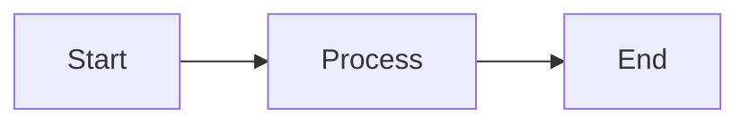

This page covers the markdown and MDX features available when writing documentation pages.

## Frontmatter

Every page starts with YAML frontmatter between `---` fences:

```yaml
---
title: Page Title
description: A short summary for SEO and link previews.
keywords: [keyword1, keyword2]
---
```

| Field | Required | Description |
|---|---|---|
| `title` | Yes | Page heading and browser tab title |
| `description` | No | Used in meta tags and search results |
| `keywords` | No | Array of terms for site search |
| `hide_table_of_contents` | No | Set `true` to hide the right-side TOC |
| `draft` | No | Set `true` to exclude the page from production builds |

## Images

### Basic usage

Standard markdown image syntax renders at full width (100%) with a border, rounded corners, and click-to-zoom lightbox behavior:

```markdown

```

Place image files in the `public/img/docs/` directory. Reference them with an absolute path starting from `/img/`.

### Custom width

Set a custom width by adding a size value in the title position (the quoted string after the URL):

```markdown

```

Supported formats:

| Syntax | Result |
|---|---|
| `` | 50% of the content area |
| `` | Fixed 400 pixels wide |
| `` | 75% — alternate prefix syntax |

Any title value that is not a recognized size (like `"My tooltip"`) passes through as a normal tooltip on hover.

### Lightbox

All images support click-to-zoom. Clicking an image opens a fullscreen lightbox overlay. Click the image again or the **X** button to close it.

### Image guidelines

- Always include descriptive alt text for accessibility.
- Pair every screenshot with written instructions — don't rely on the image alone.
- Use PNG for screenshots. Use SVG for icons or diagrams when possible.
- Keep file names lowercase and hyphenated: `api-keys-dialog.png`.

## Callouts

Use fenced directives to create styled callout boxes. Six types are available: `note`, `tip`, `info`, `caution`, `warning`, and `danger`.

```markdown
:::note
Default note with no custom title.
:::

:::tip[Pro tip]
You can add a custom title in brackets.
:::

:::warning
This highlights something the reader should be careful about.
:::
```

## Tabs

Use the `<Tabs>` and `<TabItem>` components to present tabbed content:

````markdown
<Tabs>
  <TabItem value="npm" label="npm">
    ```bash
    npm install my-package
    ```
  </TabItem>
  <TabItem value="yarn" label="yarn">
    ```bash
    yarn add my-package
    ```
  </TabItem>
</Tabs>
````

Each `<TabItem>` requires a unique `value`. The `label` controls what appears on the tab button.

## Code blocks

Fenced code blocks support syntax highlighting via Shiki. Specify the language after the opening backticks:

````markdown
```javascript
const greeting = 'Hello, world!'
```
````

### Line highlighting

Use special comments inside your code to highlight, diff, or focus specific lines:

````markdown
```javascript
const a = 1 // [!code highlight]
const b = 2 // [!code --]
const c = 3 // [!code ++]
const d = 4 // [!code focus]
```
````

| Comment | Effect |
|---|---|
| `// [!code highlight]` | Highlights the line |
| `// [!code ++]` | Shows the line as an addition (green) |
| `// [!code --]` | Shows the line as a removal (red) |
| `// [!code focus]` | Dims all other lines to draw attention |

## Mermaid diagrams

Use a `mermaid` code block to render diagrams with pan and zoom support:

````markdown

````

## Variables

Use `{vars.variableName}` in your content to insert values defined in the site configuration. Variables are replaced at render time, keeping content consistent when names or URLs change. See the `variables.ts` config file for available variable names.
