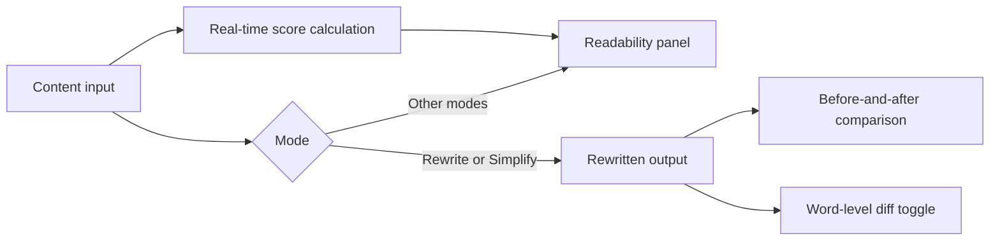

TechWrit AI calculates readability scores in real time as you type. The scores appear in the **Readability** panel below the content input. In Rewrite and Simplify modes, the output panel adds a before-and-after comparison so you can see the concrete impact of edits. See [The Squad](/squad/) for details on these modes.

## Scores

### Flesch Reading Ease (0–100)

Measures how easy text is to read — the higher the score, the easier the text.

| Score | Level |
|---|---|
| 80–100 | Easy — conversational, accessible to wide audiences. |
| 60–79 | Standard — comfortable for most readers. |
| 40–59 | Difficult — might require domain expertise. |
| 0–39 | Very difficult — academic or highly specialized. |

### Flesch-Kincaid Grade Level

Estimates the United States (US) school grade required to understand the text. A score of 8 means an eighth-grade reader can understand the text.

**Target for technical docs:** Grade 8–12 depending on audience. Set the target in **Settings → General → Reading Level**: General (Grade 6–8), Standard (Grade 8–10), or Advanced (Grade 10–12). The setting persists and applies to generated and rewritten output.

### Gunning Fog Index

Estimates years of formal education needed. Similar to grade level but weights complex words (three or more syllables) more heavily.

### Calculation notes

TechWrit AI uses standard formulas for each metric:

- Flesch Reading Ease and Flesch-Kincaid Grade Level use the original Flesch formulas based on average sentence length and average syllables per word.
- Gunning Fog Index uses the Robert Gunning formula, weighting words of three or more syllables. [VERIFY]

## Additional metrics

| Metric | What it measures | Better direction |
|---|---|---|
| Word count | Total words in the input. | Context-dependent. |
| Words per sentence | Average sentence length. | Lower (clearer). |
| Complexity % | Percentage of words with three or more syllables. | Lower (simpler vocabulary). |

## Before-and-after comparison

In **Rewrite** and **Simplify** modes, the output panel shows a side-by-side comparison of these metrics:

| Metric | Better direction |
|---|---|
| Flesch Reading Ease | Higher. |
| Flesch-Kincaid Grade Level | Lower. |
| Words per sentence | Lower. |
| Complexity % | Lower. |
| Total word count | Context-dependent. |

TechWrit AI highlights improvements in green and regressions in orange. Any change in the better direction appears in green; any change in the worse direction appears in orange. Unchanged metrics keep default text. [VERIFY: confirm threshold]

## Word-level diff

Select the **Diff** toggle in the output panel to see exactly what changed:

- **Red strikethrough** — Removed words.
- **Green highlight** — Added words.
- **Normal text** — Unchanged words.

The summary line displays the total count of removed and added words.

## Recommended targets

Use these targets as a starting point for most technical documentation: [VERIFY: confirm against product defaults]

| Audience | Flesch Reading Ease | Grade Level | Complexity % |
|---|---|---|---|
| Consumer-facing | 60+ | Grade 6–8 | Under 15% |
| Developers and engineers | 40+ | Grade 8–10 | Under 25% |
| Specialists and researchers | 30+ | Grade 10–12 | Under 35% |

These targets match the **General**, **Standard**, and **Advanced** options in **Settings → General → Reading Level**.