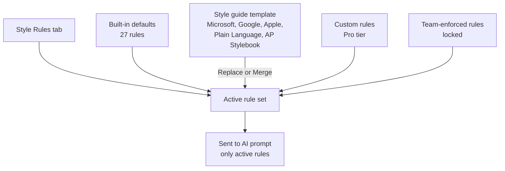

Open the Settings dialog from the user menu at the bottom of the sidebar. The dialog has five tabs:

| Tab | Configure |
|---|---|
| Style Rules | Active style rules, style guide templates, custom rules. |
| Terminology | Preferred-and-avoid term substitutions. |
| Glossary | Domain terms with definitions and synonyms. |
| Prompt Library | Your saved structured prompts. |
| General | Default reading level, custom instructions (global and per-mode), export and import. |

## Style Rules


### Default rules

TechWrit AI ships with 27 default style rules covering common technical writing standards:

| Rule | Description |
|---|---|
| Avoid "Please" | Use direct, imperative language. |
| Avoid "and/or" | Use "or" or "and" explicitly. |
| Title case in titles | Distinguish main titles from subsections. |
| Sentence case in headings | Capitalize only the first word and proper nouns. |
| Avoid "may" | Use "can" for ability and "might" for possibility. |
| "Ensure" vs "confirm" | Avoid "verify," "check," "make sure," and "validate." Use "ensure" or "confirm" appropriately. |
| Prefer active voice | Use active voice unless passive is clearer or the actor is unknown. |
| Use present tense | "The system returns" not "will return." |
| Use second person | Address the reader as "you." |
| Minimize future tense | Avoid "will" for system behavior. |
| Parallel structure in lists | Start all items with the same part of speech. |
| Define jargon on first use | Spell out acronyms and technical terms. |
| Be concise | Eliminate filler words. |
| Minimize "there is" and "there are" | Restructure sentences that begin with these phrases. |
| Consistent terminology | Use the same term for the same concept throughout. |
| Remove redundant content | Eliminate sentences that repeat the same idea as a neighbor. |
| Descriptive link text | Avoid generic text such as "click here" or "here." |
| Avoid "This topic describes..." | Use outcome-oriented intros instead. |
| User-focused writing | Write from the user's perspective, not the product's. |
| Avoid Latin abbreviations | Use "for example" not "e.g." and "that is" not "i.e." |
| Lowercase "v" for version | Use v4.8 not V4.8. |
| Short paragraphs | Keep paragraphs between 50–150 words. |
| Short sentences | Keep sentences under 20 words. |
| Procedures as numbered lists | Convert sequential steps from prose to numbered lists. |
| End steps with a period | End each numbered step with a period; steps are imperative sentences. |
| No redundant headings above steps | Don't add a heading that repeats the numbered step below it. |
| Screenshots need text instructions | Always pair screenshots with written instructions. |

### Style guide templates

The style guide selector at the top of the Style Rules tab lets you apply a pre-built rule set from a major style guide. Five templates are available:

| Template | Key differences |
|---|---|
| **Microsoft Writing Style Guide** | Direct tone, sentence case for H2+ subheadings, title case for H1. This is the default. |
| **Google Developer Docs Style Guide** | Sentence case for all headings, no "easy" or "simple," 26-word sentence limit, "select" not "click." |
| **Apple Style Guide** | Formal tone, no contractions, title case for all headings, Oxford comma, em dashes without spaces. |
| **Plain Language** | Based on the plainlanguage.gov guidance: everyday words, short sentences, active voice, and direct address. Best for non-specialist readers. |
| **AP Stylebook** | Associated Press (AP) mechanics adapted for docs: no serial (Oxford) comma, spell out numbers below 10, percent shown as `%` with figures, AP time format, and sentence-case headings. |

TechWrit AI auto-detects the active style guide from your current rule set. If your rules match a template exactly, the selector shows that template as active.



#### Switching style guides

To switch style guides:

1. Select a style guide from the dropdown at the top of the Style Rules tab.
2. Select **Apply**.
3. In the confirmation dialog, choose how to apply it:
   - **Replace** — Removes all built-in rules and replaces them with the selected style guide's rules. TechWrit AI preserves your custom rules.
   - **Merge** — Keeps your current rules and adds any new rules from the selected style guide that you don't already have.

Applying a style guide also adds that guide's terminology substitutions — for example, AP Stylebook adds "percent" to "%" preferences. TechWrit AI adds these additively and preserves your own substitutions, so you can apply a guide without losing word choices you set in the Terminology tab.

### Toggle rules

Turn rules on or off with the switch next to each rule. TechWrit AI includes only active rules in the prompt.

### Custom rules (Pro tier)

To add a custom rule, select **Add custom rule** and provide a name and description.

### Team rules

Team members see team-enforced rules with a lock icon. These remain active, and you cannot turn them off or delete them. Personal custom rules appear below team rules and count against your personal tier limits separately.

## Terminology


Terminology substitutions enforce word choice. Each entry has a **preferred** term and a list of terms to **avoid**.

The default substitutions are:

| Preferred | Avoid |
|---|---|
| select | click on, click, hit |
| enter | type in, input |
| repository | repo |
| ensure | make sure |

TechWrit AI enforces these during writing and rewriting. The input pane flags violations in real time.

Add, edit, or delete substitutions in this tab. The Free tier supports three substitutions; the Pro tier supports unlimited substitutions.

### Team terminology

Team members see team-enforced substitutions with a lock icon. You cannot edit or delete these. Add your personal substitutions in the same tab.

### Tier downgrade behavior

If you downgrade from Pro to Free with more than three substitutions configured, all substitutions remain in the configuration but only the first three remain active. Re-prioritize which three are active in the Terminology tab. [VERIFY: confirm downgrade behavior]

## Glossary


The product glossary gives TechWrit AI semantic understanding of your domain terms. Each entry includes:

| Field | Description |
|---|---|
| Term | The canonical name. |
| Definition | What it means (1–2 sentences). |
| Synonyms (optional) | Alternative names TechWrit AI should flag. |

TechWrit AI uses glossary definitions when writing, flags synonym misuse in reviews, and generates glossary sections from your content.

Add, edit, or delete entries in this tab. The Free tier supports three terms; the Pro tier supports unlimited terms.

### Team glossary

Team members see team-enforced glossary entries with a lock icon. You cannot edit or delete these. Add your personal entries in the same tab.

### Tier downgrade behavior

If you downgrade from Pro to Free with more than three terms configured, all terms remain in the configuration but only the first three remain active. Re-prioritize which three are active in the Glossary tab. [VERIFY: confirm downgrade behavior]

## Prompt Library


The Prompt Library contains reusable structured prompts that pre-fill the input area with placeholders you fill in before submitting. Use them to save time on documents you write often.

The Prompt Library ships empty — every prompt is one you create. The **Prompt Library** dropdown in the context bar appears only after you save your first prompt; until then, the dropdown stays hidden.

### Create a prompt

Create your own prompts in the **Prompt Library** tab in Settings:

1. Select **Add prompt**.
2. Enter a name and the prompt content. Use `[placeholder]` syntax for fields the user fills in.
3. Optionally set an auto-set mode and doc type.
4. Select **Add**.

You can edit or delete your prompts at any time.

### Using a prompt

1. Select the **Prompt Library** dropdown in the context bar. This dropdown appears once you save at least one prompt.
2. Select a prompt from the list.
3. The input area fills with the prompt content. TechWrit AI auto-sets mode and doc type if the prompt specifies them.
4. Replace the `[placeholder]` text with your actual content.
5. Select **Go** to submit.

Selecting a prompt replaces any current input text. You cannot insert a prompt without overwriting.

For example, a custom prompt for a deprecation notice might look like this:

```text
Write a deprecation notice for [feature name].

Deprecation date: [date]
Replacement: [replacement feature or workaround]
Migration steps: [steps for users]

Output format: A short release-note-style entry with a clear migration path.
```

When you select this prompt from the dropdown, the input area fills with this template. Replace each `[placeholder]` with your actual content before selecting **Go**.

## General


### Reading level

The **Reading Level** default sets the target reading level for output that TechWrit AI generates and rewrites. Set it once here and it persists across requests:

| Option | Target |
|---|---|
| General | Grade 6–8 |
| Standard | Grade 8–10. This is the default. |
| Advanced | Grade 10–12 |

TechWrit AI applies this default to generated and rewritten output. To check the result, see the readability scores in the **Readability** panel.

### Custom instructions

Custom instructions are freeform guidance that TechWrit AI appends to your input before each application programming interface (API) call. You can set a **global** instruction that applies to all modes, or set **per-mode** instructions that override the global instruction for specific modes.

Use the **mode selector dropdown** to switch between editing the global instruction and any of the 17 mode-specific instructions. A dot indicator next to each mode in the dropdown shows which modes have custom instructions set.

**Examples:**

- **Global:** "Our audience is enterprise information technology (IT) admins. Keep paragraphs under four sentences."
- **Review mode:** "Focus on security concerns and Open Web Application Security Project (OWASP) compliance."
- **Rewrite mode:** "Always use Oxford commas. Prefer bullet lists for non-sequential content."
- **Simplify mode:** "Target a sixth-grade reading level for this project."

### Export and import

- **Export** — Downloads a `techwrit-config.json` file containing your rules, terminology, glossary, custom instructions (global and per-mode), and custom prompts. The file uses JavaScript Object Notation (JSON).
- **Import** — Loads a previously exported JSON file, replacing your current configuration.

Use export and import to share configurations across teams or back up your standards. Imported files from older versions without newer fields (such as per-mode instructions or prompts) work — TechWrit AI leaves the missing fields unchanged.

:::note
The exported JSON file contains all your custom instructions, terminology, and glossary entries as plain text. Treat it the same way you treat other configuration files that might contain project context — don't commit it to public repositories without review.
:::

If the imported file contains entries that conflict with team-locked rules, terminology, or glossary entries, TechWrit AI skips those entries and keeps the team-enforced versions. A summary of skipped entries appears after import. [VERIFY: confirm conflict resolution behavior]

See the Configuration Reference for the full JSON schema, valid field values, and examples you can use to hand-edit or generate config files.